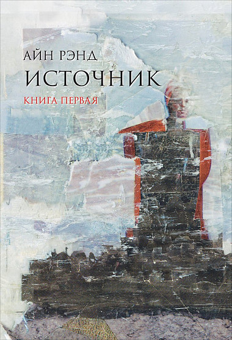

# Источник

## Полное наименование

Источник : в 2 кн. / Айн Рэнд ; Пер. с англ. - 8-е изд. - М.: Альпина Паблишер, 2016.

## Краткий сюжет

Главный герой - Говард Рорк студент архитектурного колледжа, которого исключают за то, что при выполнении курсовых проектов он пренебрегает существующими стилями и проектирует все в собственной манере, несмотря на строгую тематику, указанную в задании. Бросив учебу он нанимается к ранее известному архитектору, но ныне утратившему былую славу, Кэмерону. Многому научившись у Кэмерона, после того как тот оставил архитектурную практику, Рорк через некоторое время открывает собственное проектное бюро. Поначалу у него нет крупных заказов, но каждое его здание становится центром притяжения для людей, которые могут чувствовать настоящие первобытные силы, нашедшие воплощение в проектах Рорка.

Одновременно идет повествование про еще одного молодого архитектора Питера Китинга, который с отличием закончил университет и сразу после выпуска устроился в одно из самых престижных архитектурных бюро. Там с помощью различных интриг ему удается занять место главного проектировщика, а затем и стать партнером в фирме. При этом сам он не считает себя хорошим архитектором и регулярно обращается за помощью к Рорку, не афишируя это, пользуясь тем, что в студенчестве Рорк снимал комнату у его матери. Благодаря планировочным решения Говарда его проекты становятся популярными и даже выигрывают конкурсы на строительство.

Через какое-то время к Рорку перестают обращаться и он, чтобы заработать денег идет работать на каменоломню, где встречает Доминик Франкон - утонченную журналистку, ведущую колонку в популярной газете "Знамя". Там у них возникает небольшой роман, причем Доминик не догадывается, что этот рабочий на самом деле является архитектором многих известных зданий.

Также нас знакомят с Эллсвортом Тухи - архитектурным критиком, голосом толпы, который как и Доминик работает в "Знамени". Тухи проповедует принципы самоотречения и гуманизма, отвергая эгоизм, тем самым он завоевывает симпатию больших масс читателей газеты и получает возможность управлять мнением толпы. Он заводит большое количество знакомств с людьми искусства разных областей: писателями, театралами и архитекторами. Среди архитекторов самые лучшие отношения у него с Питером Китингом, которому он регулярно помогает получить очень выгодные заказы.

Из-за разницы в идеологии Тухи и Рорка, Тухи помогает получить Рорку заказ на постройку храма, для того чтобы потом уничтожить репутацию Говарда изобличительными статьями в газетах. При создании этого храма Рорк нанимает архитектора Стивена Мэлори, который делает для храма скульптуру, в качестве натурщицы для которой выступила Доминик Франкон. После скандала с храмом заказчик подает на Рорка в суд, в результате которого Говарда обязывают профинансировать перестройку святилища в детский дом.

Доминик выходит замуж за Питера Китинга и, пользуясь своей популярностью в высших кругах, помогает мужу получить большое количество крупных заказов. Благодаря этому бюро Китинга становится лидером на рынке по количеству выполняемых проектов.

В это время Эллсворт Тухи распространяет свое влияние на глас толпы, становясь негласным лидером нескольких ассоциаций: литераторов, драматургов и архитекторов. Во всех масс-медиа у Тухи есть свои люди, которым однажды он как-либо помог. Особенно сильно он продвигает своих протеже, которые в своем творчестве прославляют ничтожество человека и его долг в отношении общества.

Говард Рорк сидит без заказов, пока неожиданно для самого себя не побеждает в конкурсе на разработку комплекса отдыха. После постройки комплекс становится невероятно популярным, несмотря на отсутствие всякой рекламы. Оказалось, что заказчики проекта были жуликами и, получив огромную сумму от инвесторов, рассчитывали на то, что никто не будет посещать это место, тем самым они бы признали бы себя банкротами, при этом остались бы с разницей между вкладами инвесторов и суммой строительства. Проект помог Говарду получить известность на всю страну, и заказы потекли рекой.

Нас знакомят с финансовым магнатом, владельцем ежедневной газеты «Знамя» и большим количеством других изданий - Винандом. Несмотря на то, что «Знамя» является типичным бульварным листком, который пишет только то, что является востребованным у массового читателя, сам Винанд - это человек твердых убеждений, решительно идущий к своим целям.

Винанд владеет собственной галереей, в которую он никого не пускает. Эллсворт Тухи, раздобыв статую Доминик, дарит ее Винанду, разыгрывая свою многоходовочку. Винанд чрезвычайно впечатляется статуей и ищет встречи с женой Китинга. После их встречи, каждый из двоих понимает, что перед ними сильная личность, достойная уважения. Винанд предлагает Доминик развестись с мужем и выйти замуж за него, она соглашается.

После свадьбы Винанд понял, что не хочет ни с кем делить Доминик и начал искать архитектора, который построил бы дом, где можно было бы спрятать жену от общества. Для разработки и постройки дома он нанимает Говарда Рорка. Тот понимает, для кого строится этот дом, но не подает вида, что имел тесную связь с Доминик.

Питер Китинг после развода утратил поток заказов, который ему приносила жена. В поисках заказа он обращается за помощью в проектировании конкурсной работы к Рорку. Рорк заключает с ним контракт, что никто не узнает о том, кто на самом деле проектировал здание, но взамен Питер должен выполнить проект в точности с документацией, разработанной Говардом. Питеру не удается сохранить здание без изменений из-за давления со стороны Эллсворта Тухи. Не в силах терпеть издевательства над своим проектам Рорк ночью взрывает строящееся здание. Его арестовывают и заключают под стражу до решения суда.

Винанд сильно привязался к Рорку во время постройки своего дома и нашел в нем хорошего друга. После заключения Говарда он начинает кампанию в "Знамени" в его защиту. Из-за того что его позиция не совпадает с мнением народа, газета стремительно теряет популярность, и из нее увольняется большое количество сотрудников. На собрании акционеров газеты большинство держателей акции принимают решение изменить позицию газеты в отношении Говарда, и Винанд покоряется этому решению. После чего его бросает Доминик, для того чтобы вернуться к Рорку.

Несмотря на то, что Эллсворт Тухи всеми силами настраивал народ против Рорка, Говарда оправдывают в суде, благодаря тому, что в состав присяжных входили работяги - знатоки своего дела.

Книга заканчивается тем, что Говард Рорк и Доминик Франкон стоят на вершине здания, строящегося по заказу Винанда.

## Рефлексия

Основная идея книги - торжество подлинного эгоизма и его роль в развитии общества. Забавно, что при этом Говарду Рорку противопоставляется Эллсворт Тухи, который, распространяя свою сеть влияния, преследует цель получить власть над людьми. Весьма эгоистическая цель!