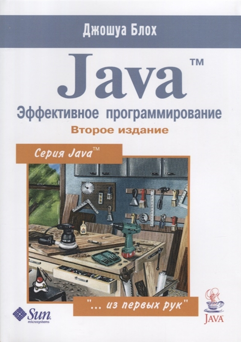

# Java. Эффективное программирование

## Полное наименование

Джошуа Блох. Java. Эффективное программирование. Второе издание / пер. Е. Коротылев. -Издательство "Лори", 2017. - 440 с.

Отличная книга с замечательными идеями о том, как писать код на Java так, чтобы он действительно был готов к расширению и был легкоподдерживаемым. Часть информации устарело с выходом новых версий Java.

Русское издание - полный отстой. Разметка кода плывет, а некоторые главы переведены Google-переводчиком и не редактировались техническим специалистом.

В английском издании - must have для любого Java-разработчика. Тем более, что уже вышло третье издание, учитывающее изменения в Java 7, 8, 9.