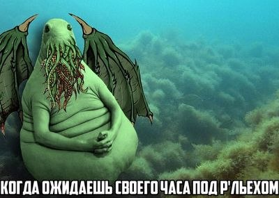
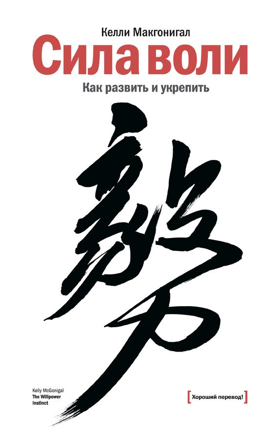
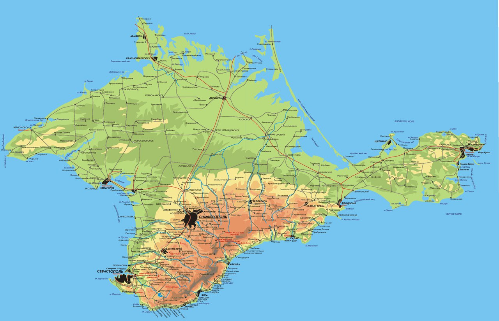
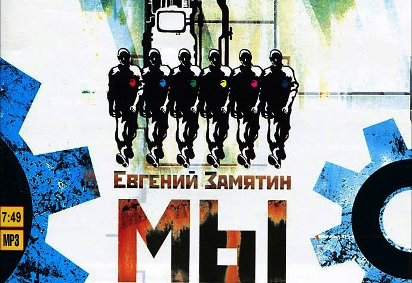

Книжный марафон

- [X] Ужас в музее. Г.Ф. Лавкрафт
- [X] Сила воли. Келли Макгонигал
- [X] Источник. Айн Ренд
- [X] Мы. Замятин
- [X] Оружие и системы вооружения. Левин, Одинцов.
- [ ] Электроника. Платт
- [ ] Чапаев и пустота. В. Пелевин
- [X] Остров Крым. В. Аксенов
- [X] Inferno. Dan Brown
- [X] Мастяжарт ... ГСКБ-47 ... ФГУП ГНПП Базальт

Резерв

- [X] Текст. Глуховский

---
## **Первая книга**: Г.Ф. Лавкрафт. Ужас в музее: рассказы, повести.

Это уже не первая книга Лавкрафта, прочитанная мной, поэтому я уже знаком с ктулхуанским пантеоном.

Ктулху, Йог-Сотот, Дагон и прочие товарищи - постоянные гости в расказах Лавкрафта. Понимание таинственного мира, наполненного созданиями, существование которых не поддается человеческому осмыслению, приходит не сразу. С каждым прочитанным рассказом все больше становится известно об этих мистических существах и их появлении на нашей планете. Поэтому даже проходные истории читать интересно - ведь с каждым рассказом познаешь мир Лавкрафта глубже и глубже. Может потому Лавкрафт заходит даже тем людям, которым не нравятся ужасы и мистика. Собирать мир, описанный им, по кусочкам - увлекательнее сборки пазла, и ты чувствуешь себя приобщенным к тайным знаниям мира и уже мечтаешь прочитать Некрономикон.

В сборнике "Ужас в музее" представлены рассказы, написанные Лавкрафтом в соавторстве с другими писателями, поэтому не рекомендую начинать знакомство с автором с этой книги. Но для тех кто уже знаком с его творчеством, книжка послужит хорошим дополнением к пониманию вселенной Лавкрафта и добавит пару кусочков к собираемому "пазлу".

---
## **Вторая книга**: Келли Макгонигал. Сила воли. Как развить и укрепить.

Это одна из тех иностранных книжек по популярной психологии, которые написаны будто по какой-то методичке: сначала излияния на 10 страниц о том, какая это замечательная книга и сколько полезного она принесет в вашу жизнь, а затем основная часть, где смысл, способный уместиться на нескольких страницах, растворен в огромном океане воды.

И несмотря на это книгу стоит прочитать.

Потому что она открывает глаза на многие неочевидные особенности нашего поведения, и на то почему, зачастую, мы поступаем совершенно нелогично. Некоторые из объяснений были мне уже знакомы (Не думай о белом медведе), но большинство были новы для меня. Особенно меня впечатлила работа системы обещания награды в нашем мозгу и особенности работы такого нейромедиатора, как дофамина.

В книге приведено большое количество советов о том, как избавиться от соблазнов и укрепить силу воли. К сожалению, чтобы следовать этим советам, необходимо читать данную книгу в течение 10 недель. И мне бы хотелось пообещать, что я вернусь к "Силе воли" и выполню все упражнения из нее после своего книжного марафона, но боюсь, что моя пока еще непрокаченная сила воли на это не способна. ЛОЛ

---
## **Третья книга**: Василий Аксенов. Остров Крым.

Книга представляет фантазию автора на тему: как развивались бы события, если отступающая белая армия окопалась бы в Крыму, и так и не сдала бы своих позиций перед наступающими силами красных. Действие разворачивается в конце 70-х - начале 80-х. Остров Крым стал чем-то вроде Сингапура: геополитическим центром. Только под крылом могущественного угрожающего Советского Союза. Главный герой поддерживает идею объединения Крыма с СССР, что в итоге оборачивается трагедией для него и его семьи.

По такому краткому описанию может показаться, что автор просоветский. Но это не так. И даже наоборот. Стоит упомянуть, что книга была опубликована только с развалом СССР - спустя 10 лет после ее написания.

Сюжет раскрывать не буду, опишу только несколько уроков, которые мне дала книга.

1. Все советские люди мечтали выбраться хоть на денек в капиталистический мир, чтобы почувствовать вкус свободы и закупиться "фирмой". Даже высокие члены партии.
2. Во все времена существования советской власти в СССР были декаденты - бывшие аристократы, которые презирали все эти показушные миртрудмаи и мечтали выбраться из-за железного занавеса.
3. В деловых разговорах важнее не слова, а их отсутствие и интонации. И чем выше пост твоего собеседника, тем аккуратнее нужно подбирать слова и тем сильнее сдерживать язык за зубами.

Книгу рекомендую, но советую пропускать страницы, в которых описываются отношения главного героя с женщинами. А то мерзко будет.

---
## **Четвертая книга**: Мастяжарт - ГСКБ-47 - ФГУП "ГНПП "Базальт". Под общей редакцией А.Л. Рыбаса.

Ни для кого не секрет, что я работаю в АО "НПО "Базальт". Когда я устроился сюда в 2012 г. мне показалось, что Базальт вечен. Что он всегда был таким, какой он есть сейчас. Всегда занимался авиабомбами и гранатометами, всегда в нем были Тульский и Нерехтинский филиалы, всегда на нем работали те же люди, что и сейчас.

Оказалось, что нет.

Базальт прошел через многое: в начале разрабатывались только авиабомбы, потом были противопехотные мины, затем Базальту отдали гранатометную тематику; одно время все конструкторское бюро занималось исключительно двухсредными торпедами. В связи с этими изменениями были большие перестановки в кадровом составе. Базальт жил, пульсировал, развивался.

Многое было сделано в социальной сфере, но сейчас результаты этих трудов уже не видны: детский лагерь в Красноармейске стал общежитием, в дома отдыха никто не ездит, дома для сотрудников предприятия больше не строят.

Многое было утрачено в 90-ые годы, и далеко не все восстановлено. Для того чтобы Базальт оставался на плаву необходимо многое сделать. В первую очередь подготовить хорошую смену специалистам старшего поколения, чему, на мой взгляд, сейчас уделяется недостаточно усилий.

Книга написана общими усилиями многих людей и потому от главы к главе стиль изложения меняется. Но от книги и не ждешь художественности изложения, ведь ее главная задача - описать историю становления и развития Базальта. С чем она неплохо справляется.

---
## **Пятая книга**: Е.И. Замятин. Мы.

Эта книга была в моем списке, но я не должен был читать ее на этой неделе. Дело в том, что мне не хватило времени на "Электронику для начинающих", и я решил прочитать то, что точно бы осилил за 3-4 часа воскресенья.

Роман-антиутопия, в котором немногие выжившие после разрушительной войны основали город, окружили его стеклянной стеной, и довели все коммунистические идеи до абсолюта. Все принадлежит каждому, секс получают по талонам, жизнь каждого человека подчиняется строгому расписанию, чтобы не было простоев.

Хотите подробно ознакомиться с сюжетом - идите на Википедию, там представлен замечательный краткий пересказ.

Сюжет классический - утопический мир живет идеальной (казалось бы) жизнью, но есть недовольные, которые организуют революцию, а главный герой оказывается в центре происходящих событий. При этом многие его действия совершенно нелогичны, в чем он и сам частенько сознается в своем дневнике. Кажется, что все эти ошибки в его поведении всего лишь костыли, призванные повернуть сюжет в нужное русло.

Что касается слога - он мне категорически не понравился. Автор пытается крупными мазками эмоций главного героя создать импрессионистическую картину происходящего. Но воспринимать это достаточно тяжело. Например, я совсем не понял, что произошло на космическом корабле "Интеграл", строителем которого был главный герой, - удался ли план повстанцев или провалился?

Если сравнить книгу с другими антиутопиями, то мой голос уйдет "1984" Оруэлла. Возможно, Замятин был первопроходцем в данном жанре и без его романа не вышло бы книг его более талантливых последователей, но книжка откровенно слабенькая.

