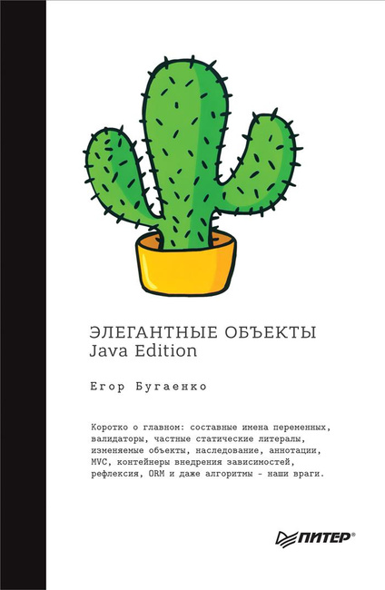

# Элегантные объекты. Java Edition

## Полное наименование
Бугаенко Е. Элегантные объекты. Java Edition. - СПб.: Питер, 2018. - 240 с.: - (Серия «Библиотека программиста»).

## Обобщенный отзыв

Егор Бугаенко - неоднозначный персонаж в IT-сфере. Иногда он генерирует интересные идеи (2.8 Используйте fake-объекты вместо mock-объектов; 3.2 Не используйте статические методы), иногда повторяет прописные истины так, будто он их придумал (2.3 Всегда используйте интерфейсы; 4.1 Никогда не возвращайте NULL), а иногда он пишет полный бред (4.2 Бросайте только проверяемые исключения).

Мне кажется, что автор просто пытается накидать максимальное количество идей, приходящих ему в голову, рассчитывая, что некоторые из них могут оказаться жизнеспособными. При этом он не пытается глубоко погрузиться в те проблемы, которые могут повлечь за собой реализации его идей.

Возможно такой подход хорош для мозгового штурма, но после него всегда должен присутствовать этап отсеивания нежизнеспособных идей.

Представленные в книги примеры кода написаны на отвали. Как будто автор хотел выразить какую-то идею, но не смог подобрать подходящего примера. Такой подход можно простить для личного блога или для статьи на хабре, но для книги, которую называют «ООП Лобачевского» это неприемлемо.

Многие фрагменты кода, критикуемые автором (и им же написанные), намеренно написаны плохо.

Несмотря на это некоторые идеи автора позволяют взглянуть на привычные способы написания ООП кода под другим углом, и заставляют задуматься: «А правильно ли я пишу код?».

Платить за такую книгу 40$ (столько за нее просит Егор Бугаенко на своем личном сайте) явно не стоит. Покупать ее, если при этом еще не освоены более основополагающие труды, тоже не стоит.

Книга не требует при ее чтении садиться за редактор кода и проверять какие-то идеи. Ее можно читать в дороге, в очереди или в любом другом месте.

Если есть возможность взять ее почитать в свободное время (например в отпуск) у друга / коллеги / рабочей библиотеки, то можно попробовать.

Для начинающих разработчиков, ищущих себе каких-либо звезд из области Java-разработки:

Если выбирать себе кумира, то выбирать Егора Бугаенко однозначно не стоит, несмотря на то, что он появляется на множестве конференций, его статьи резонансно обсуждаются, и он часто появляется в различных IT-подкастах. Вместо этого я бы больше предпочел менее скандальных и более глубоко мыслящих Джошуа Блоха или Тагира Валеева.

### Понравившиеся идеи

- В истинном ООП все должно быть объектами, примитивных типов быть не должно.
- Никогда не использовать null, никогда не создавать классы с @Nullable полями. Если есть желание написать такое, то оно проистекает из лени. Необходимо переработать структуру классов и интерфейсов так, чтобы не гонять null-поля по программе.
- Тесты должны быть неотъемлемой частью класса. В случае с Java тесты должны были бы быть рядом с методами в том же классе, а не лежать отдельно.
- Вместо мокирования писать внутри интерфейса его fake-реализация. Это полезно т.к. привязка тестов к внутренним деталям реализации делает тест хрупким и несопровождаемым.
- Никогда не принимать null в качестве аргумента метода
- Гетеры и сеттеры были созданы, чтобы нарушать принцип инкапсуляции, хотя обычно декларируется обратное
- Вызывайте отказ как можно скорее, если вы беспокоитесь о качестве не только отдельного метода, но и приложения в целом

### Качество полиграфии

Первоначально взял книгу с работы и прочитал ее, затем купил свой личный экземпляр и перенес туда свои комментарии.

Книга из рабочей библиотеки издания 2018 г., отпечатана в г. Киров в АО «Первая Образцовая типография».

Купленный экземпляр 2019 г. издания и отпечатан в г. Можайск в ОАО «Можайский полиграфический комбинат».

Что сразу бросается в глаза - книги отличаются размером. Новое издание такой же величины, как и другие книги издательства Питер. Старое издание чуть меньше - приблизительно в габаритах покетбуков.

Бумага у нового издания хуже: она менее мелованная, легче рвется, и краска на некоторых страницах немного расползается.

Шрифты в книге тоже другие, не могу сказать лучше или хуже, просто другие.

В тех разделах, где автор приводит критику своих тезисов другими людьми, в более раннем издании имена комментаторов были выделены полужирным шрифтом, в новом издании они не выделены вовсе. Восприятие из-за этого ухудшается.

### Качество перевода

Хотя автор и русскоговорящий, но книга в оригинале написана на английском языке, переведена при этом она не самим Егором Бугаенко, а профессиональным переводчиком. В книге множество специальных терминов, а также иногда употребляются некоторые программистские фразеологизмы. К. Русецкий - переводчик этой книги прекрасно справился с этим сложным текстом, за что ему отдельное спасибо. Надеюсь, что издательство Питер и дальше будет привлекать Русецкого к переводам новых книг.
