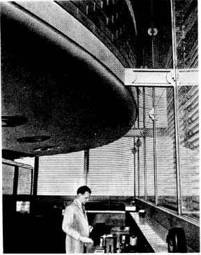
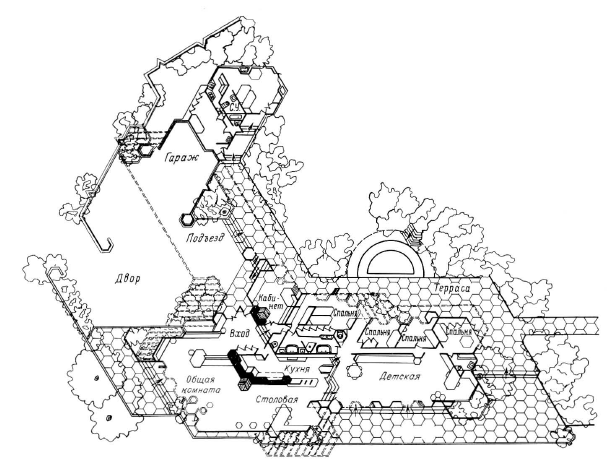
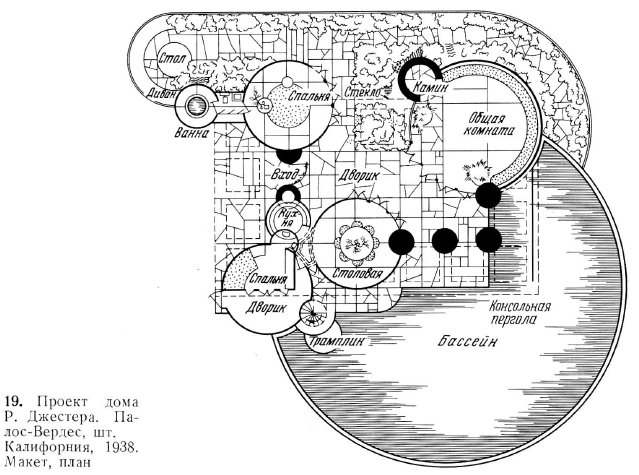

# Франк Ллойд Райт

## Полное наименование
А.Ф. Гольдштейн. Франк Ллойд Райт. М., Стройиздат, 1973, 136 стр.

## Отзыв
Несмотря на то, что книга написана крайне непоследовательным в своих высказываниях человеком, она позволяет сложить некоторое мнение об архитекторе Райте.

Как и следовало ожидать, Райт не был мессией от архитектуры, и, несмотря на многие шедевры, воздвигнутые им, он построил и много неудачных зданий. Например, многие здания, в которых была заложена хорошая идея, оказывались неприспособленными для каких-то бытовых операций. Так, башня-лаборатория компании "Джонсон" имела интересное остекление: внутренний слой обычного стекла и внешний слой из стеклянных трубок, которые давали рассеянный свет и из-за многочисленных преломлений искажали вид улицы, что придавало лабораторным помещениям атмосферу уединенности. Но также эти стеклянные трубки в солнечный день давали большое количество ослепляющих бликов, а их мытье требовало специального инструмента.

Безусловно многие черты Говарда Рорка, главного героя книги «Источник» заимствованы от Фрэнка Ллойда Райта: это и неоконченный университет, и практика у великого новатора современной архитектуры (Салливен = Кэмерон из книги), и наличие черных полос в карьере, и, главное, твердая уверенность в своем архитектурном видении.

Почему-то сам Райт свое сходство с персонажем книги отрицал.

Впечатляет то, что Райт в совсем юные годы (в районе 23 лет) смог убедить главу архитектурного бюро взять его к себе на работу с единовременной выдачей денег на постройку дома для семьи Райта.

Странно, что автор не упомянул об увлечении Райта японскими гравюрами, которые сильно повлияли на его архитектурный стиль. В длинных козырьках скатов крыш можно разглядеть черты японских пагод. Забавно, что при всех своих заимствованиях из культуры страны восходящего солнца, Райт построил в Японии отель в чисто европейском стиле.

Несомненным достоинством книги является то, что в ней приведены планы различных этажей зданий, построенных по проектам Райта. По ним видно, что архитектор зачастую заигрывал с различными архитектурными формами просто по фану: отсюда его дома с шестигранником в качестве основной формообразующей фигуры, или так и не воплощенный дом, состоящий полностью из пересечения цилиндрических поверхностей.

Мне наиболее импонируют дома Райта, построенные для жизни той или иной семьи. Архитектор всегда создавал дом и как крепость, которая отрезает весь внутренний быт от суеты улицы, и как место для общения с природой. Ведь зачастую его частные дома были обращены к улице глухой стеной или ленточными окнами под самой крышей, при этом выход из дома во двор часто делался почти полностью открытым, остекленным.