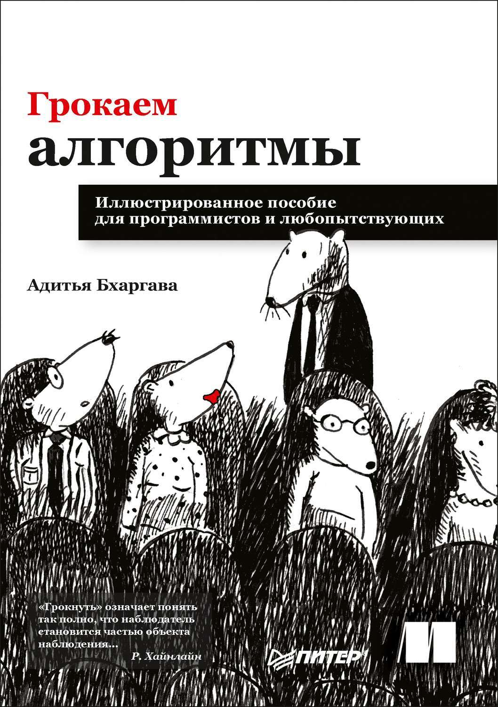

# Грокаем алгоритмы

Максимальное количество операций, которое необходимо будет выполнить алгоритму оценивается величиной О(f(n)), где n - количество обрабатываемых объектов.

Наиболее типичные значения О() :

- О(n) - линейное время
- O(log n) - логарифмическое время. Пример: бинарный поиск
- O(n * log n) - Пример: быстрая сортировка
- O(n^2) - медленные алгоритмы. Пример: сортировка выбором
- O(n!) - очень медленные алгоритмы. Пример: задача о коммивояжере