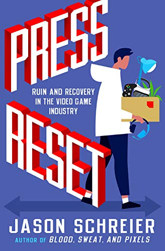

# Нажми Reset

## Полное наименование

Нажми Reset. Как игровая индустрия рушит карьеры и дает второй шанс / Джейсон Шрейер ; [перевод с английского М. Бочарова и др.]. - Москва: Эксмо, 2021. - 368 с. - (Легендарные компьютерные игры)

## Отзыв

Это вторая книга Джейсона Шрейера про геймдев.
Первая была больше о конкретных играх и истории их разработки.
Эта же больше об индустрии, как работодателей.
Здесь затрагиваются вопросы массовых увольнений после сдачи проектов, постоянных переездов разработчиков из города в город из-за поисков работодателей и кранчах.

Весь рассказ строится вокруг разработчиков, участвовавших в создании Bioshock. 
Видимо у автора было много контактов из той команды.

Конечно, меня потрясла история компании 38 Studious.
Эта компания заключила договор с одним из американских штатов, что они обязуются обеспечить множество рабочих мест, а взамен они получают огромную ссуду.
Они перевезли в этот штат всех своих сотрудников, а через год обанкротились, оставив людей в незнакомом городе с открытыми договорами аренды.

Припоминаю, что я слышал эту историю, когда она произошла, но тогда она меня особо не впечатлила.
Это была очередная новость про банкротство очередной компании.
Индустрия была далека от меня.
К тому же все происходило в Америке - тогда для меня это был совершенно другой мир.

Сейчас же я вполне могу себе представить, что компания отправляет тебя в какой-нибудь город, типа Сызрани, а через год, когда ты уже успел обосноваться, обжиться, тебя увольняют.
И больше работодателей по твоей специальности в городе нет.
А ты купил здесь квартиру на все свои деньги.
Жесть!

Почитал отзывы на Goodreads - многие недовольны тем, что автор осветил индустрию только с одной стороны: выставил разработчиков жертвами, а корпоративных боссов хладнокровными скупердяями.
Например: негодяйские боссы требуют, чтобы в мобильную игру встроили таймеры и микроплатежи.
Но разработчики - они же творцы, они хотели создать игру с плавным повествованием.
Как для ПК, только на мобилки.
Естественно, они добавляют функционал микротранзакций через жопу и игра не выстреливает.
Кто в этом виноват?
Автор считает, что боссы из EA.
Но разве разработчики не должны учитывать особенности платформы, под которую они выпускают игру, и особенности монетизации игры?

## Игорь тонет
Как и в случае с предыдущей книгой, я наметил для себя пару игр, на которые было бы интересно посмотреть / поиграть:
- Bioshock (да, я не играл ни в одну часть)
- Enter the Gungeon

## Издание
У нас книгу выпустило издательство Бомбора (дочка Эксмо).
Оформление точно такое же, как у предыдущей книжки, только почему-то изменилось направление текста на корешке.
В первой книге снизу вверх, а во второй сверху вниз.