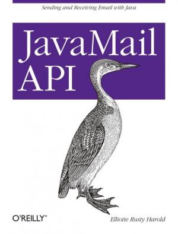

# JavaMail API

## Полное наименование
JavaMail API by Elliotte Rusty Harold. Published by O'Reilly Media, Inc., 1005 Gravenstein Highway North, Sebastopol, CA 95472

## Краткий отзыв

Книга по сути является простым описанием API библиотеки JavaMail. Оно немного устарело, потому что книга вышла в 2013 году и с тех пор не переиздавалась. По сути она не содержит в себе ничего, чего не было бы в официальной документации к библиотеке и javadoc'ах. Возможно официальная документация была отредактирована по материалам этой книги, потому что документация кода на голову выше самого кода (коротко: он не очень).

В книге не представлено базовых сведений о работе электронной почты и стандартных почтовых протоколов.

Книгу я читал в рамках подготовки к докладу, посвященному работе с электронной почтой из Java-приложений. 
Доклад есть в текстовом виде на [гитхабе](https://github.com/Boiarshinov/learning-mail/blob/master/docs/article.md).
Также на его основе я написал [статью на хабр](https://habr.com/ru/post/526162/).
