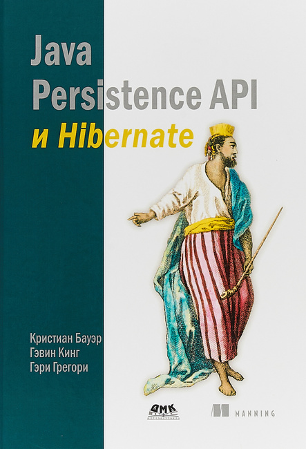

# Java Persistence API и Hibernate

## Полное наименование

Бауэр К., Кинг Г., Грегори Г. Java Persistence API и Hibernate / пер. с англ. Д.А. Зинкевича; под науч. ред. А.Н. Киселева. 2-е изд. - М.: ДМК Пресс, 2017. - 632 с.: ил.

ISBN 978-5-97060-180-8



Зачастую рекомендуют использовать какие-то инструменты, которые есть только в Hibernate, что грозит вендор-локом.

---
## Best Practices

- При настройке сущностей предоставлять дополнительные методы, позволяющие положить новый элемент в поле-коллекцию и при этом создать необходимую обратную связь.
```java
public void addCourse(@NonNull final Course course) {
    course.setStudent(this); //перед этим можно проверить, что до этого связи между курсом и студентом не было
    this.courses.add(course);
}
```

- При настройке сущностей доступ к полям-коллекциям предоставлять с помощью геттеров, при этом в геттере оборачивать коллекцию в `Collections.unmodifiableCollection()`.
- Настройку сущностей лучше проводить с помощью аннотаций, а XML применять только в случае необходимости
- Первоначально объявлять все хранимые классы как Value Type, а потом переводить их в разряд сущностей (Entity) по мере необходимости.
- Использовать одинаковое имя для идентификатора во всех классах предметной модели.
- Не создавать сеттер для идентификатора.
- Всегда использовать суррогатные ключи вместо естественных.
- При объявлении в сущности поля коллекции лучше сразу ее инициализировать