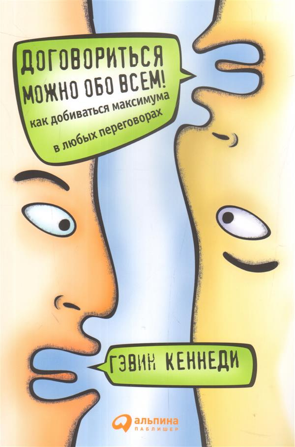

# Договориться можно обо всем

Я прочитал данную книгу в августе-сентябре 2018 года, когда захотел изучить переговорные стратегии. Книга оказалась очень полезной и открывающей глаза на многие приемчики, используемые различными продавцами, соисполнителями и заказчиками. К концу книги мне показалось, что некоторая информация дублируется, но те знания, что я вынес после прочтения книги перекрывают с лихвой любые ее недостатки.

При чтении я делал пометки при ответах на тесты самооценки, для того чтобы можно было оценить свой прогресс при возможном повторном прочтении. Все отметки с вопросов я стер, оставив их в конце каждой главы, где даны ответы, и в итоговой таблице.

## Краткие выводы по каждой главе

### Глава 1
Существует четыре крайности поведения человека при переговорах:

- Ослы. Упорно стоят на своей позиции, не замечая возможных выгод для себя.
- Овцы. Легко запугать. Не видят выгодных для себя вариантов.
- Лисы. Умело манипулируют оппонентами. Могут не заметить обоюдовыгодных для сторон вариантов, из-за устремленности всегда быть в плюсе, что может в итоге повредить долгосрочным отношениям.
- Совы. Продумывают все наперед. Ищут долгосрочных выгод. Не поддаются на манипуляции со стороны оппонента.

### Глава 2
Дети - одни из лучших переговорщиков, благодаря тому, что они точно знают что им нужно, и тому, что они не придают значения тем препятствиям, что стоят на пути между ними и целью.

С возрастом люди теряют способность твердо отстаивать свою позицию, из-за того, что пытаются войти в положение своего собеседника. Собеседник изливает свои проблемы, в результате чего ты размягчаешься и делаешь уступки. Хотя все его проблемы могли быть выдуманы единственно для того, чтобы снизить твои требования.

### Глава 3
Если покупка или продажа происходят без оспаривания цены, то ни покупатель, ни продавец потом не чувствуют удовлетворения от сделки. Оба будут жалеть, что не продавили оппонента, и согласились на ту цену, которую назначил оппонент. Покупатель будет искать недостатки в товаре, а продавец будет жалеть, что продешевил. Торг же приносит удовлетворение обоим сторонам сделки.

### Глава 4
Сценарий переговоров №1 (в данной книге такие сценариями являются проверкой изученного материала).

### Глава 5
Если другая сторона не выполняет свои обязанности, нужно не просто жаловаться, но предлагать варианты решения проблемы или условия компенсации ущерба.

Например, если Билайн долго не оформляет договор на перенос номера, то можно при звонке им по данному можно предложить им компенсировать те деньги, которые ушли на оплату мобильной связи другого оператора или интернета (я тупанул и не сделал так).

### Глава 6
Ни в коем случае нельзя делать уступки, которые не сопровождаются ответными уступками со стороны оппонента.

### Глава 7
При составлении договора необходимо учесть как можно больше "что если". То же самое следует сделать при подготовке к переговорам.

### Глава 8
Сценарий переговоров №2.

### Глава 9
Добровольные уступки не смягчают другую сторону - они делают ее позицию еще более жесткой

### Глава 10
Иногда стоит ошарашить другую сторону своими требованиями, которые далеко выходят за пределы вилки цен (или не цен) той стороны.

Прием "Матушка Хаббард": я очень бы хотел воспользоваться вашим предложением, но условия слишком жесткие и я не смогу их выполнить в полном объеме.

Если другая сторона пытается изменить цену, ни в коем случае нельзя на это идти, иначе другая сторона поймет, что это было просто уловкой. Можно жонглировать только дополнительными условиями сделки.

### Глава 11
Ни в коем случае нельзя говорить, что торг уместен, потому что это сразу дает понять другой стороне, что твоя цена (условия сделки) сильно завышены. При наличии такой фразы (позиции) уже никогда не получится получить озвученную сумму (условия сделки).

### Глава 12
Необходимо, как волк бороться за свои условия и отстаивать их с максимальной решительностью. Для этого необходимо серьезно подготовиться, приготовив обоснования для каждого пункта своих требований.

### Глава 13
Сценарий переговоров №3.

### Глава 14
Самое полезное слово переговорщика: ЕСЛИ. Если твоя позиция обоснована, то ничего нельзя отдавать даром, должны быть ответные шаги с другой стороны.

### Глава 15
С любым неадекватным поведением другой стороны необходимо сохранять хладнокровие и профессионализм. Если на тебя давят, орут или пытаются воздействовать другим способом, необходимо не терять самообладание и обсуждать вопросы по существу.

### Глава 16
Крутость другой стороны, ее сила не должны оказывать влияние на твою позицию.

Справедлив взгляд и с другой стороны: можно запугать оппонента, заявив о каких-то обстоятельствах ему неизвестных.

Даже если ты уверен в своей позиции и считаешь, что сила на твоей стороне, может оказаться, что ты не владеешь всеми данными и твоя позиция не так уж устойчива.

### Глава 17
Для того чтобы подкрепить свою позицию можно придумать некое лицо, которое способно влиять на условия сделки (жену, начальника, тещу), и сказать, что это лицо запретило соглашаться на условия хуже таких-то.

Если подобным образом поступает другая сторона, то нужно добиваться возможности вести переговоры напрямую с лицом, принимающим решения.

### Глава 18
Твердых цен не существует. Всегда можно найти причину снизить стоимость.

### Глава 19
Сценарий переговоров №4

### Глава 20
Делая уступки, можно привести свою компанию (семью) к краху. Каждый уступленный процент выливается в огромную сумму в долгосрочной перспективе.

### Глава 21
Если ты продавец, то уменьшение цены должно быть последним возможным шагом при ведении переговоров. До этого нужно попробовать изменить другие варианты сделки.

В качестве переменных для обсуждения могут выступать: способы оплаты, доставка, комплектация, риски, время

### Глава 22
Все внешние атрибуты богатства и статуса другой стороны нужны только для того чтобы запугать тебя. Нужно не обращать на них внимания.

В чем-то повтор главы 16.

Соответственно, если ты хочешь заранее настроить оппонента на послабления с его стороны, необходимо дать ему почувствовать свою ничтожность. Понты - все!

### Глава 23
Одним из самых частых приемов в переговорах являются угрозы. Надо научиться не реагировать на них.

Самому же лучше ими не злоупотреблять есть серьезная возможность разрушить отношения с другой стороной, настроив их на деструктивный лад (месть).

### Глава 24
В этой главе перечислено большое количество "грязных" уловок манипуляции другой стороной. К сожалению, все они ставят под угрозу долгосрочные отношения.

### Глава 25
Не стоит рассказывать другим о своих нуждах, лучше сосредоточиться на их интересах. Если только ты не пользуешься приемом Матушка Хаббард. Но если у тебя действительно есть какие-то проблемы, то лучше их не раскрывать, чтобы не давать другой стороне преимущества (кто владеет информацией - тот владеет миром).

### Глава 26
Следует уважать другую сторону, там работают такие же профессионалы, как и ты.

При поездках заграницу необходимо подготовиться, изучив особенности ведения переговоров в этой стране.

Экзамен

1. Они могут оставить себе контрольный пакет акций. При наличии данного пакета они могут самостоятельно принимать решения, и тем самым загубить разработку или оставить Марселя без гроша.
2. Долгосрочный интерес: завершить разработку операционной системы в кратчайший срок, заключить договоры с крупнейшими производителями компьютерной техники и сделать свою ОС стандартом в компьютерной индустрии.
3. Есть ряд решений:
    1. Сделать выплату банка не единовременной, а растянутой во времени из учета финансирования необходимых статей при разработке ОС.
    2. Предложить банку перейти на использование данной ОС в своих подразделениях абсолютно бесплатно. При необходимости можно еще вдобавок разработать необходимые банку приложения для этой ОС.
    3. Хреновый вариант: предложить им процент от дальнейших сделок с производителями компьютерной техники.
    4. Хороший вариант: в договоре прописать, что все операции по покупке данной ОС производителями компьютерной техники будут осуществляться через этот банк.
4. хз
5. Постараться связаться с еще несколькими банками, чтобы столкнуть их между собой.