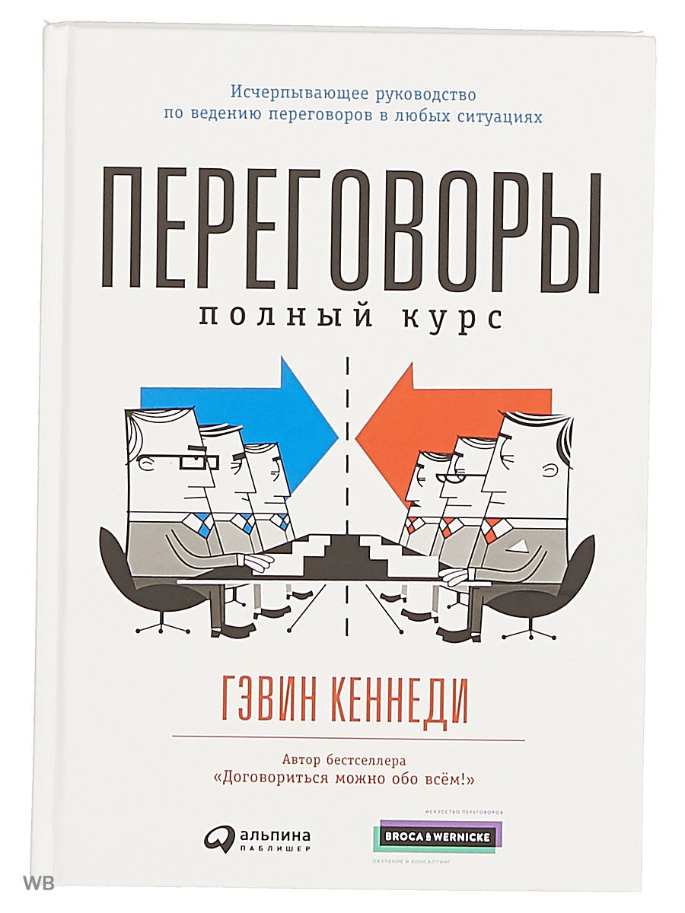

# Переговоры. Полный курс


Автор предлагает рассматривать переговоры как поэтапный процесс.
Сам автор имеет две модели: попроще и посложнее.

В сложной модели он выделяет восемь этапов:
1. Подготовка;
2. Обсуждение (спор);
3. Сигналы и знаки;
4. Внесение предложений;
5. Формирование пакета вопросов;
6. Торг;
7. Завершение торга;
8. Соглашение.

В простой модели он выделяет четыре этапа:
1. Подготовка. Вопрос: Чего мы хотим?
2. Обсуждение. Вопрос: Чего хотят они?
3. Предложения. Вопрос: Какие желания могут стать объектом торга?
4. Торг. Вопрос: Какие желания станут объектом торга?

**Подготовка**

Чем больше времени ты потратишь на подготовку, тем сильнее будет твоя позиция на переговорах.

- **Сила**

Необходимо понять на чьей стороне находится сила.

Сила определяется отношением того, что вы потеряете если сделка не пройдет, к тому, что вы потеряете если сделка пройдет.

Оценить потери можно по методу Аткинсона: записав негативные последствия и определив вероятность их возникновения. Затем нужно дать определенную ценность (значимость) каждому последствию в баллах от 0 до 10 и перемножить вероятности на ценность каждого последствия. В каждой категории нужно сложить получившиеся значения и сравнить суммы категорий между собой.

Например: Базальт обсуждает с Заказчиком возможность выполнения ОКР. Заказчик требует, чтобы Базальт провел работу за очень короткий срок и за маленькую цену.

Если Базальт откажется выполнять работу:

- Испортятся отношения с заказывающим подразделением МО РФ и может больше не поступать заказов. `8 - 30%`
- Нечем будет загрузить конструкторов и платить им. `8 - 20%`

Если Базальт согласится выполнять работу:

- Базальт не успеет проделать работу в установленные сроки. `5 - 90%`
- Денег не хватит на покрытие затрат на ОКР и придется расходовать свои средства. `9 - 60%`
```
8*0,3 + 8*0,2 = 4
5*0,9 + 9*0,6 = 9,9
```

`4 < 9,9` - следовательно сила на стороне ХЗ кого. В книге написано очень непонятно, поиск в гугле ясности не привнес. Мне кажется, что на курсере в курсе Sucsessful Negotiating было более понятное объяснение.

### Обсуждение лицом к лицу

Уловки бывают основаны на трех принципах:

- доминирование
- формирование
- завершение

**Доминирующие уловки**
- Понты. Например, шикарный офис из красного дерева и тигром, заключенным в клетку в углу зала. Уловка направлена на то, чтобы создать заранее образ крутизны, дороговизны и серьезности. Автор считает, что это дешевая уловка, которой пользуются только компании, неспособные к долгосрочным отношениям, которые наживаются на клиентах, которых удалось ввести в заблуждение. Как правило, все представления о крутости фирмы развенчиваются спустя некоторое время после того, как договор уже заключен. Эта же уловка обозревалась в главе 22 [Гэвин Кеннеди. Договориться можно обо всем][kennedy].
- Предварительные условия. В случае применения данной уловки до начала переговоров заявляется, что переговоры могут быть проведены только при условии выполнения или невыполнения каких-либо требований. Например, переговоры с террористами могут быть начаты только при условии освобождения всех стариков, детей и инвалидов из заложников. Многие эксперты не считают данный прием уловкой.
- Прессинг. Прием основан на том, чтобы заявить другой стороне, что у вас есть другой поставщик/покупатель/etc, которые согласны на более выгодные для вас условия. Тем самым вы вынуждаете другую сторону торговаться с отсутствующим игроком.
- Ложные крайние сроки. Этот прием используется для того чтобы вы из-за спешки не могли объективно оценить условия сделки. Такой прием постоянно используется на всяких сайтах лендингах, где висит скидка на товар, и указано, что она будет действовать всего несколько часов/дней/недель (в зависимости от цены товара).
- Матушка Хаббард. Данный прием основан на том, чтобы убедить другую сторону в том, что вы очень заинтересованы в их предложении, но, к сожалению, ваши ресурсы не позволяют приобрести их товар, по крайней мере без существенной скидки. Эта уловка гораздо лучше описана в главе 10 [Договориться можно обо всем][kennedy].

**Уловки формирования**
- Хороший парень/плохой парень. Если и применять эту уловку, то нужно сделать так, чтобы другая сторона думала, что хороший парень и плохой парень работают в разных подразделениях и потому у них совершенно противоположные суждения.
- Создание вымышленного заинтересованного лица (принципала). Способ хорошо описан в главе 17 [Договориться можно обо всем][kennedy]. Лучший способ борьбы с этой уловкой - это создать в ответ своего собственного принципала.

**Уловки завершения**
Про них я ничего не нашел

Существует два вида аргументов:

1. Открытые - аргументы, которые подлежат обсуждению, и могут быть изменены в ходе обсуждения.
2. Закрытые - аргументы, на которые невозможно повлиять.

Если собеседник использует закрытые аргументы, а ты твердно уверен, что он не прав, и можешь это доказать с помощью своей аргументации, то лучше прекратить дискуссию, так как она все равно ни к чему не приведет.

Для того чтобы сделать закрытый аргумент открытым, необходимо какое-либо сильное потрясение или вмешательство третьей стороны.


[kennedy]: kennedy_everything_is_negotiable.md