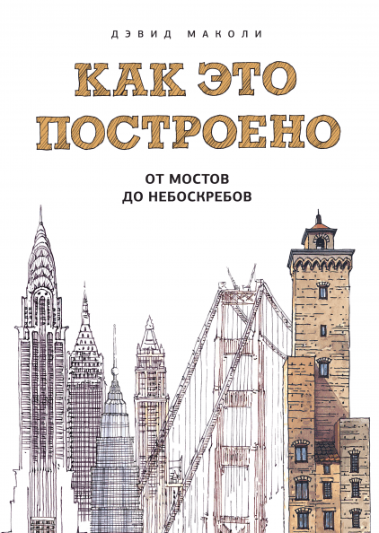

# Как это построено

## Полное наименование

Как это построено: от мостов до небоскребов. Иллюстрированная энциклопедия / Дэвид Маколи ; пер. с англ. М. Гескиной. - 5-е изд. - М.: Манн, Иванов и Фербер, 2020. - 192 с.: ил.

## Отзыв

Эту книжку я купил почти что на сдачу.
На одной конференции за проявленную активность меня наградили сертификатом на 1000 рублей в издательстве МИФ.
Та книга, которую я хотел купить стоила чуть больше, а за ее доставку нужно было выложить еще кругленькую сумму.
Поэтому, для того чтобы снизить стоимость доставки я добавил в заказ еще одну книжку на одну из интересующих меня тем (в МИФе вообще тяжело найти интересную книжку - большая часть литературы у них это книги об успешном успехе).
Этой книжкой была "Как это построено".

### Не все то грязь, что не блестит
После того как прочитал книжку, я зашел на [goodreads](https://www.goodreads.com/), чтобы поставить оценку и зачекиниться - и очень удивился.
Средняя оценка далека от пятерки и на книгу множество негативных отзывов.
Основная проблема - книга позиционируется издательством, как книга для детей.
Даже на корешке подписано - "МИФ Детство".
Еще бы, в ней много иллюстраций и мало текста.
Но если она и подходит для детей, то только для старшего школьного возраста.
В книге рассматривается то, как распределяются силы и нагрузка, даются некоторые термины из сопромата.
Чтобы воспринять все это, наверное нужно иметь некоторую подготовку в области физики: стоит разбираться в механике на уровне 7-8 класса.
Так что я не рекомендовал бы дарить такую книгу детям до 14 лет.

Был еще один отзыв, где читательница делилась тем, что она ожидала увидеть в этой книге больше истории строительства всех этих сооружений, а не инженерные нюансы.
Здесь она, конечно, промахнулась и выбрала не ту книгу.

Для меня же книжка 10/10.
Я теперь фанат Дэвида Маколи и хотел бы прочитать и другие его иллюстрированные книги.
Чем же мне так понравилась "Как это построено"?

### Собственно отзыв
В книге рассмотрены нюансы строительства мостов, туннелей, плотин, куполов и небоскребов.

**Мосты**.
Так вот где сопромат применяется в полную силу!
В книге показано какие бывают типы мостов, что они представляют собой с точки зрения сопромата и как воспринимают нагрузки.
Если бы все эти заделки, шарниры и фермы объясняли бы на примере мостов, учить сопромат было бы намного веселее.

**Туннели**.
Здесь показали, как работали первые проходческие щиты и как устроены современные. 
И чем отличается пробивка туннеля в горах от прокладывания под водой.

**Дамбы** великолепны.
Мало того, что по масштабам дамбы наверное самые крупные постройки, так они еще и приносят существенную пользу человечеству!
Постройка дамбы - это что-то невероятное.
В книге описаны все этапы ее постройки - от отведения воды через деривационные туннели до остужения застывающего бетона.

По сравнению с дамбами любые другие проекты (особенно те, над которыми работаю я) кажутся незначительными.
Теперь стало понятно почему здания различных строительных проектных институтов в Москве такие большие :-).

В 21 веке человечество начало чаще задумываться об экологии и о разрушительных последствиях постройки дамб.
Наверное таких крупных дамб, как есть сейчас уже не будут строить в пользу более экологичных источников энергии.

**Купола**. 
На мой взгляд наименее интересная часть книги.
Они, конечно, формируют облик города и являются важными архитектурными доминантами, но у них нет утилитарного назначения (почти).
Из-за этого кажется, что все изыски при постройке куполов - это сплошное писькомерство - "ля, как могу".

**Небоскребы**.
В этой главе рассмотрено как изменился подход к постройке небоскребов от несущих фасадных стен к несущему внутреннему каркасу, и как современные архитекторы борются с ветром.

#### Иллюстрации
Иллюстрации для таких книг, как эта подходят лучше фотографий. 
Они позволяют убрать незначительные детали, сделать произвольные вырезы и сечения, которые демонстрируют устройство того или иного объекта.
Еще благодаря тому, что все иллюстрации выполнены одним человеком, книга воспринимается более целостно.

Впечатляет, что нарисовал эти иллюстрации сам автор книги.

#### Жертвы
Потрясает еще и количество людей, которые погибают на масштабных стройках.
Туннель Хусак унес ~200 жизней, а Асуанская дамба - порядка 500 (каждый 60-й рабочий).
Сейчас такое количество жертв кажется дикостью, а ведь Асуанская дамба строилась не так давно - в 60-х годах прошлого века.

Кажется, что темные времена прошли, и современные стройки ведутся со всеми мерами предосторожности.
Например, строительство туннеля под Ла-Маншем обошлось совсем без жертв (по крайней мере мне не удалось найти информации об их наличии).
