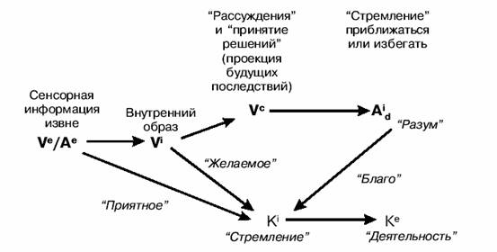

    
# Стратегии гениев

## Основы НЛП

- Карта не есть территория.

    Этот принцип хорошо изложен в 7 навыков высокоэффективных людей и я с ним полностью согласен.

- Модели стратегий:
    - TOTE - test-operate-test-exit
    - SOAR - state-operator-and-result

        Модель очень похожа на функции, используемые в программировании: ты заводишь в функцию начальные данные, она совершает какие-либо действия и выдает результат.

    - Модель ROLE - Representational systems, Orientation, Links, Effects

        Эту модель придумал сам автор книги. Модель призвана помочь определить основные элементы поведения, которые приводят к определенным результатам.

    - Модель SCORE - Symptoms, Causes, Outcomes, Resourses, Effects.

- Существует три вида стратегий (по масштабности):
    - Метастратегии (модель SOAR)
    - Макростратегии (модель TOTE)
    - Микростратегии (модель ROLE)

## Аристотель

Кажется, что Аристотель за две тысячи лет назад разработал такие модели, которые переоткрывают только сейчас. А может и нет. Может из-за того, что его тексты очень древние и приходится как-то додумывать окончания некоторых фраз (отмечено в книге квадратными скобками), эти тексты можно по-разному воспринимать и потому подогнать под ту точку линию, которую гнет автор. Но из тех цитат Аристотеля, которые приводит автор, совершенно явно, что Аристотель заложил начала алгебры логики.

Аристотель ввел такое понятие как силлогизм

Для того чтобы обнаружить какое-либо основополагающее качество, объединяющее группу объектов, Аристотель советует выделить из этой группы две подгруппы, одна из которых сходна по какому-либо другому качеству, а вторая сходна по третьему. Затем необходимо определить все общие основополагающие качества в первой подгруппе и во второй. С большой степенью вероятности качества лежащие в пересечении этих двух подмножеств и будут искомыми основополагающими качествами. Автор книги пытается обнаружить качества, лежащие в корне гениальности выдающихся личностей, с помощью этого метода.

Люди этого не осознают, но они сильно чувствительны к общим свойствам. Например, симметричность. Симметричность звуков, изображения.

Люди различают какие-либо чувства только на контрасте с чем-либо другим.

Считается, что та репрезентативная система (орган чувства) человека, которая наиболее полно может описывать окружающий мир для конкретного человека, становится для него определяющей, человек начинает в ней специализироваться. На этом утверждении основаны многие техники НЛП.

Рассмотрена модель ROLE и получена схема принятия решений, выведенная Аристотелем в формальной записи этой модели

Рассмотрена модель SCORE.

Предложены наводящие слова-связки, которые способны увеличить литературные способные любого человека. Данные связки помогают раскрыть какое-либо утверждение, превратив одну фразу в целый параграф. Вот эти связки:

- поскольку
- до того, как
- после того, как
- в то время, как
- как только
- таким образом, что
- если
- хотя
- таким же образом, как

## Шерлок Холмс

Чем больше человек развивает в себе способность делать что-либо хорошо, тем меньше он осознает, как именно он это делает.

Макростратегия Холмса состоит в том, что на основе наблюдений делаются частные выводы, которые затем приводят к общему заключению.

Дедукция является как раз процессом получения вывода из набора предпосылок. При этом набрасываются различные версии, часть из которых потом убирается из-за появления новых или переосмысления старых наблюдений.

При наблюдении Холмс обращает внимание в первую очередь на субмодальности объекта.

Еще одной макростратегией Холмса является:

1. Интерпретация смысла вводимой информации или события. На интерпретацию может влиять большое количество факторов: время, место, окружающая обстановка и т.д.
2. Полнота/всеобъемлемость охвата проблемного пространства.

## Уолт Дисней
Дисней в своей работе принимал три позиции:

- Мечтатель
- Реалист
- Критик

Каждая из позиций имеет свою микростратегию.

Автор рекомендует при решении творческих задач чередовать различные позиции, предварительно заякорив каждую из них. Для того чтобы переключение между позициями происходило легче (чтобы разные позиции не оказывали друг на друга влияния) автор рекомендует чередовать переход через метапозицию.

Мечтатель определяет что делать. Реалист продумывает как делать. Критик раздумывает почему это нужно делать и почему именно так, как предложил реалист.

Данная модель хорошо подходит для проведения совещаний. У Диснея для каждой из трех моделей поведения было свое помещение.

Как проводить совещания. Способ 1:
1. Мозговой штурм способа решения проблемы
2. Определение конкретных шагов для реализации выбранного способа
3. Рассмотрение выбранных решений и выдача замечаний
4. Мозговой штурм устранения замечаний
5. И т.д.
   
Как проводить совещания. Способ 2:
1. Заслушивание предложений одного выступающего
2. Дополнение идей выступающего остальными участниками

## Вольфганг Амадей Моцарт

Моцарт был мастером образования синестезий. Музыкальные фрагменты он мог визуализировать, осязать или даже чувствовать на вкус. Переводя небольшие музыкальные кусочки во вкус он составлял блюдо. Несколько блюд переводил в изваяния или картины, а картины переводил в общее эмоциональное состояние. Таким образом задействовались почти все репрезентативные системы и процессы творчества и запоминания происходили легче, чем при записи музыкальных фрагментов в виде нотной грамоты.

На моцартовском приниципе основаны некоторые клавиатурные тренажеры, в которых на экране монитора показывается расположение кистей рук и подсвечиваются те пальцы, которые должны в тот или иной момент нажимать на клавиши. Таким образом образуются синестезии между кинестетической и визуальной репрезентативными системами и процесс обучения идет намного быстрее. Еще одним примером использования синестезий является рекомендация Дейла Карнеги при подготовке к публичной речи подготовить карточки, но не со словами, а с изображениями. При этом к аудиальной репрезентативной системе подключается визуальная.
