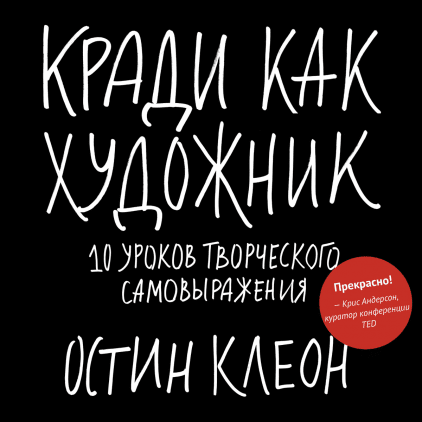

# Кради как художник

## Полное наименование

Кради как художник. 10 уроков творческого самовыражения / Остин Клеон;  пер. с англ. С. Филина. - 7-е изд. - М.: Манн, Иванов и Фербер, 2019. - 176 с.

## Отзыв

Книга невероятно короткая, и хотя в ней 176 страниц, на половине из них рисунки, сделанные дошкольником, а на второй - по несколько строк с бабушкинским шрифтом. По объему это скорее лонгрид в интернете, чем полноценная книга.

Автор утверждает, что если каждый день писать по одной странице, то за год можно сочинить роман. Судя по всему свою книгу он написал за неделю.

Полезные советы из книги, которые стоит взять на вооружение:

1. Найти себе кумиров, проанализировать их путь, их методы работы. Хорошей идеей будет повесить на своем рабочем месте их портреты.
2. Необходимо сочетать работу за монитором с работой руками.
3. Непрочитанная библиотека важнее, чем прочитанная

Прочие советы:

1. Не стесняться заимствовать чужие идеи. При заимствовании ("краже") нужно объединять несколько чужих идей в одну, либо модернизировать идею на свой лад.
2. Не бояться показаться самозванцем при выполнении какой-либо работы. Чтобы приступить к работе без страха можно попробовать сыграть роль хорошего специалиста и тогда в перспективе действительно стать им.
3. Создавать то, чего не хватает в жизни.
4. Отдыхать от мыслей и поступающей информации, чтобы дать мозгу поработать бессознательно и переварить накопившуюся информацию.
5. Делиться с другими своими результатами, если они вызывают удивление или восторг.
6. Менять обстановку.
7. Если ты самый умный человек в комнате, то ты не в той комнате.
8. Отмечать цепочки при привитии привычек, завести дневник.
9. Сознательно в чем-то ограничивать себя при творческих поисках.