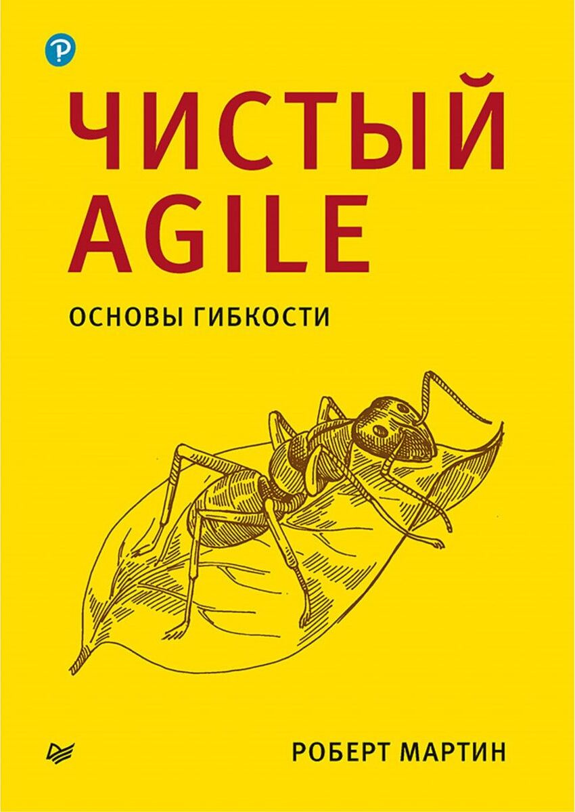

# Чистый Agile

## Полное наименование

Мартин Роберт. Чистый Agile. Основы гибкости. - СПб.: Питер, 2021. - 352 с.: ил. - (Серия "Библиотека программиста").

## Мысли

Понравилась критика того, куда Agile зашел сейчас, со всеми сертификациями скрам-мастеров и agile-коучами, которые никогда не писали код.
> Agile-коучи, у которых нет опыта ведения бизнеса и опыта технических работ, обучают менеджеров и говорят разработчикам, что им делать.

Не понравилась позиция по дейли-митингам. 
Если на них нужно рассказать только чем ты занимался вчера и чем будешь заниматься сегодня и нельзя делиться своими проблемами, переживаниями, просить помощи и т.д., то зачем они вообще нужны?
Можно же ту же информацию написать в чат.

Не очень понял критику ALM. 
Речь же шла про инструменты типы Jira?
Видимо мне повезло не сталкиваться с ее проблемами, потому что я не понял почти все претензии к ALM.

> Принципы без методов - ноль без палочки, в то время как методы без принципов, как правило, заучиваются механически, без лишних раздумий. 
> Принципы направляют методы. 
> Методы воплощают принципы. 
> Они идут рука об руку.