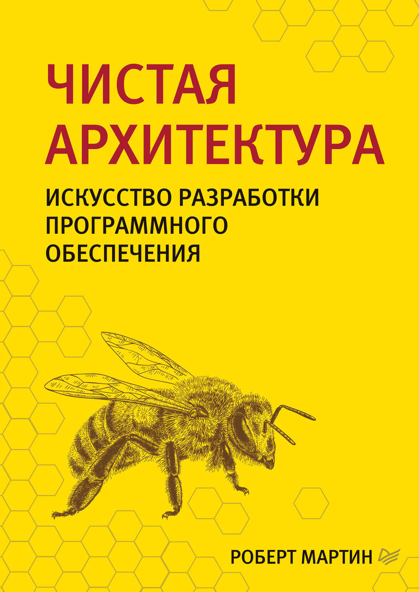

# Чистая архитектура

## Полное наименование

Мартин Р. Чистая архитектура. Искусство разработки программного обеспечения. - СПб.: Питер, 2018. - 352 с.: ил. - (Серия "Библиотека программиста").

## Отзыв

Восхитительная книга, которая открывает глаза на то, как должна выглядеть идеальная архитектура приложения.

Думаю, что мне не раз еще придется заглядывать в нее, для того чтобы уточнить правильные подходы к организации зависимостей и подчерпнуть какие-то идеи.

Забавно, что сильнее прочих мне понравилась глава, написанная не Р. Мартином, а Симоном Брауном.

Также мне понравился автобиографический раздел о карьере дядюшки Боба. Было бы интересно прочитать его полную биографию.