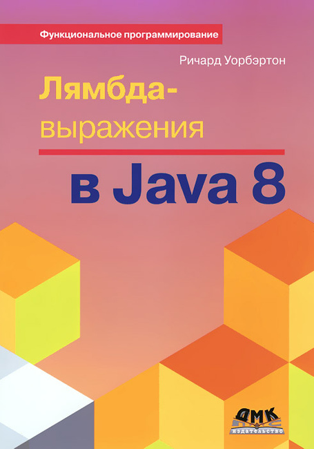

# Лямбда-выражения в Java 8

## Полное наименование

Уорбэртон Р. Лямбда-выражения в Java 8. Функциональное программирование - в массы / пер. с анг. А.А. Слинкина. - М.: ДМК Пресс, 2017. - 192 с.: ил.

## Основные мысли из книги (в виде цитат)

- Отложив вычисление до момента, когда мы будем больше знать о желаемом результате и операциях, мы сможем затем выполнить его более эффективно.
- Но, пожалуй, самое время задуматься о том, стоит ли раскрывать в модели предметной области объекты List или Set явным образом. Быть может, лучше создать фабрику объектов Stream. У доступа к кол­лекциям через интерфейс Stream есть большое преимущество - улуч­шенная инкапсуляция структуры данных модели. Если вы раскры­ваете только Stream, то пользователь ваших классов никоим способом не сможет повлиять на внутреннее содержимое List или Set.
- Передавая лямбда-выражения в методы интерфейса Stream, являю­щиеся функциями высшего порядка, стремитесь избегать побочных эффектов. Единственное исключение - метод forEach, который явля­ется финальной операцией.
- Рекомендуется всюду, где возможно, пользоваться функциями, специализированными для примитивных типов, потому что они ра­ботают быстрее.
- Ясно также, что существует четкое различие между интерфейсами и абстрактными классами. Интерфейсы открывают возможность мно­жественного наследования, но не имеют полей, тогда как абстрактные классы позволяют наследовать поля, но унаследовать сразу несколь­ким таким классам нельзя.
- Некоторые операции для упорядоченных потоков оказываются бо­лее накладными. Эту проблему можно решить, отказавшись от упо­рядочения. Для этого достаточно вызвать метод потока unordered.
- Конкурентность означает, что выполнение двух задач перекры­вается во времени. В случае параллелизма выполнение двух задач реально происходит в одно и то же время.
- Мы больше не можем считать, что масштабировать программу удастся за счет перехода на более быстрый процессор, теперь прихо­дится применять в своих интересах особенности архитектуры совре­менных процессоров.
- Параллельная потоковая библиотека особенно хороша для задач, в которых над большим количеством данных производятся простые операции, например для моделирования.
- Чем больше времени тратится на обра­ботку каждого элемента потока, тем выше потенциальный вы­игрыш от распараллеливания.

Оказалось, что дефолтные и статические методы были введены в интерфейсы для того чтобы обеспечить обратную совместимость функционального кода Java 8 с кодом, написанным на более ранних версиях Java. Например, для того чтобы ввести стримовые методы в интерфейс Collection и не заставлять всех разработчиков, переходящих на Java 8, добавлять в свои кастомные классы, реализующие Collection, методы stream(), forEach() и другие.